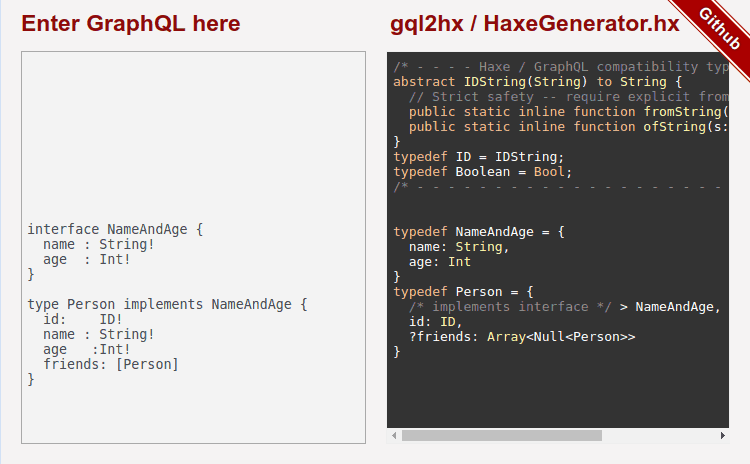

# haxe-graphql

Tools for parsing GraphQL schema and queries into Haxe type definitions.

**Status:** alpha - see various projects for their feature / compatibility notes.

[Try gql2hx live in your browser!](http://jcward.com/gql2hx/)

See the various directories under `./proj`:

- [hxgen](./proj/hxgen) - Haxe Code Generator (from GraphQL AST)
- [parser](./proj/parser) - Pure-Haxe GraphQL parser (direct port from graphql-js)
- [gql2hx-npm](./proj/gql2hx-npm) - NPM module packaging the Haxe Generator
- [gql2hx-haxelib](./proj/gql2hx-haxelib) - Haxelib module providing macro-time access to these tools
- [ast](./proj/ast) - GraphQL AST Definitions
- [webdemo](./proj/webdemo) - live demo of .graphql -> Haxe code

Development sponsored by:

